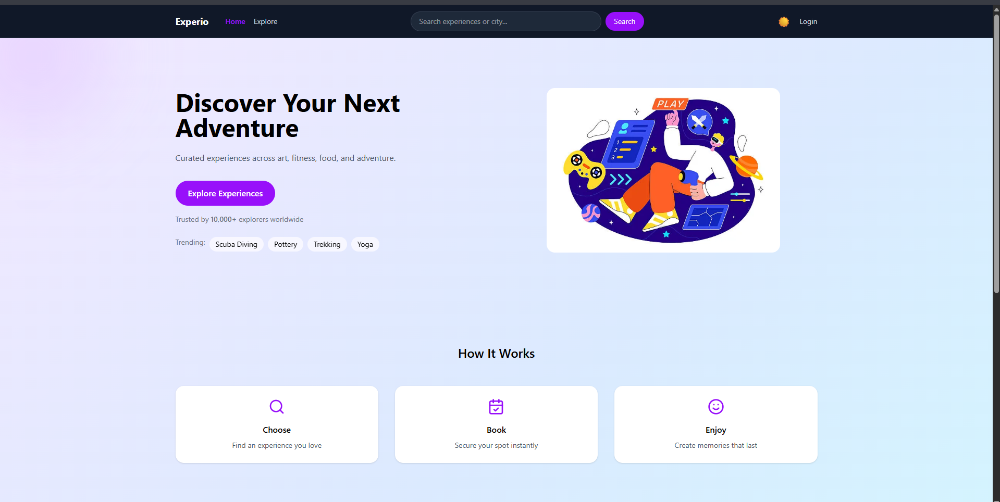

# 🌍 Experio — Premium Experience Marketplace

Experio is a modern, premium **experience marketplace web application** inspired by platforms like Airbnb Experiences and Peloton.  
It allows users to discover, filter, and explore curated experiences such as workshops, adventures, fitness sessions, and live events.

Built with a strong focus on **UI polish, micro-interactions, and smooth animations** to deliver a production-ready frontend experience.

---


## 📸 Screenshots

### Home Page


### Explore Page

## ✨ Key Features

### 🏠 Landing Page
- Gradient-based hero section with illustration
- Trending search tags (Scuba Diving, Pottery, Trekking, Yoga)
- Social proof ("Trusted by 10,000+ explorers")
- “How It Works” section for clear user onboarding
- Popular experiences carousel
- Fully responsive design

### 🔍 Explore Marketplace
- Experience listing with images, ratings, city, and price
- Category-based filtering (Art, Fitness, Food, Music, Adventure, Learning)
- Price range slider
- Search with debounce
- Sort dropdown
- Skeleton loaders & empty states
- Mobile-friendly filters drawer

### 🎨 UI & UX Enhancements
- Framer Motion animations (hover, transitions)
- Shared animation configs for consistency
- Dark mode support across the app
- Glassmorphism-inspired cards
- Smooth micro-interactions for a premium feel

### ⚙️ Architecture & Code Quality
- Component-driven structure
- Centralized animation config
- Mock backend using `json-server`
- Clean separation of pages and components

---

## 🧰 Tech Stack

- **React (Vite)**
- **Tailwind CSS v4**
- **Framer Motion**
- **React Router DOM**
- **JSON Server** (mock API)


---

## 📁 Project Structure
   ```bash
experio
├── public/
│ └── vite.svg
├── src/
│ ├── animations/
│ │ └── motionConfig.js
│ ├── assets/
│ │ └── react.svg
│ ├── components/
│ │ ├── Breadcrumbs.jsx
│ │ ├── EmptyState.jsx
│ │ ├── ExperienceCard.jsx
│ │ ├── ExperienceDetail.jsx
│ │ ├── FiltersSidebar.jsx
│ │ ├── Footer.jsx
│ │ ├── Hero.jsx
│ │ ├── HowItWorks.jsx
│ │ ├── MobileFiltersDrawer.jsx
│ │ ├── Navbar.jsx
│ │ ├── PopularSection.jsx
│ │ ├── SearchBar.jsx
│ │ ├── SkeletonCard.jsx
│ │ └── SortDropdown.jsx
│ ├── pages/
│ │ ├── Home.jsx
│ │ └── Marketplace.jsx
│ ├── screenshots/
│ │ ├── Home.png
│ │ └── Explore.png
│ ├── App.jsx
│ ├── index.css
│ └── main.jsx
├── db.json
├── package.json
├── vite.config.js
└── README.md
   ```
## 🔮 Future Improvements

- Authentication (Login / Signup)
- Wishlist functionality
- Experience detail page with booking flow
- Real backend integration
- Pagination / Infinite scroll
- Accessibility improvements

---

## 👨‍💻 Author

**Yadnik Kamble**  
Frontend Developer | React | UI/UX Enthusiast  

GitHub: [@yadnik-kamble](https://github.com/yadnik-kamble)
